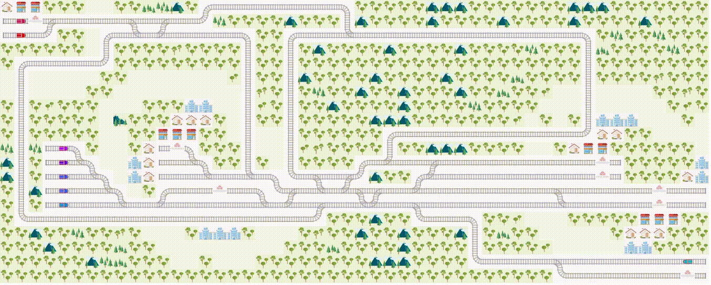

# Flatland: Multi-Agent Reinforcement Learning (MARL) in a Railway Traffic Management System (TMS)

Repository for the development of the Flatland 2021 challenge.

This submission ranked 3rd on the leaderboard for reinforcement learning.

 
